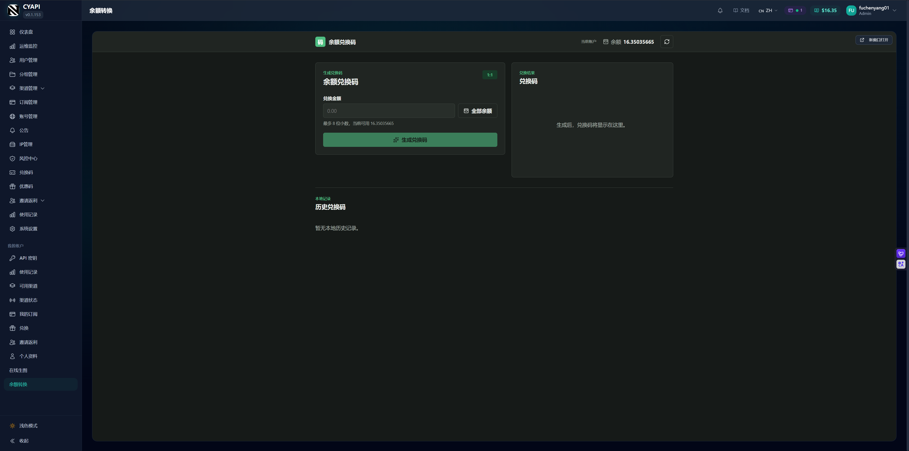

# sub2api 余额兑换码工具

这是一个独立部署的 Web 工具，可以让已经登录 [Wei-Shaw/sub2api](https://github.com/Wei-Shaw/sub2api) 的用户，把账户余额按 `1:1` 转换成永久余额兑换码。

例如，用户账户中有 `100` 余额，可以输入单码面值 `10`、数量 `3`，一次生成 3 张面值均为 `10` 的兑换码。总扣款是 `10 x 3 = 30`，生成成功后用户余额变成 `70`，兑换码可以在 sub2api 的兑换页面使用。

本工具不修改 sub2api 源码，也不复制 sub2api 数据库。它通过 sub2api 已有的用户 API 和管理员 API 完成身份验证、生成兑换码和扣减余额。

只有加入配置的 sub2api 专属分组的用户才可以兑换余额。前端是否显示入口不是安全边界：服务端会在每次受保护请求中重新验证用户的实时分组。

> [!WARNING]
> 本工具涉及真实余额。请先阅读“重要限制与风险”，并严格保持单实例运行。建议先用测试账户和小额余额完成验收，再开放给用户。

## 界面预览



## 目录

- [界面预览](#界面预览)
- [项目用途](#项目用途)
- [它是怎样工作的](#它是怎样工作的)
- [批量生成怎么用](#批量生成怎么用)
- [重要限制与风险](#重要限制与风险)
- [零基础生产部署](#零基础生产部署)
  - [第 0 步：准备服务器、域名和权限](#第-0-步准备服务器域名和权限)
  - [第 1 步：解析工具域名](#第-1-步解析工具域名)
  - [第 2 步：通过 SSH 登录服务器](#第-2-步通过-ssh-登录服务器)
  - [第 3 步：安装部署软件](#第-3-步安装部署软件)
  - [第 4 步：创建 sub2api 管理员 API Key](#第-4-步创建-sub2api-管理员-api-key)
  - [第 5 步：下载项目](#第-5-步下载项目)
  - [第 6 步：填写生产环境配置](#第-6-步填写生产环境配置)
  - [第 7 步：构建并启动容器](#第-7-步构建并启动容器)
  - [第 8 步：配置 Nginx 反向代理](#第-8-步配置-nginx-反向代理)
  - [第 9 步：申请 HTTPS 证书](#第-9-步申请-https-证书)
  - [第 10 步：在 sub2api 添加自定义菜单](#第-10-步在-sub2api-添加自定义菜单)
  - [第 11 步：完成上线验收](#第-11-步完成上线验收)
- [日常维护](#日常维护)
- [常见问题排查](#常见问题排查)
- [结果待确认与人工核对](#结果待确认与人工核对)
- [安全说明](#安全说明)
- [环境变量参考](#环境变量参考)
- [本地开发](#本地开发)

## 项目用途

适合以下场景：

- 允许用户把暂时不用的账户余额转换成兑换码。
- 允许用户保存、转赠或在其他账户中兑换余额。
- 不想修改 sub2api 源码，希望把工具作为独立服务维护。
- 希望用户继续使用 sub2api 的登录状态，不再注册一套新账号。

本工具不提供以下能力：

- 不提供独立注册或密码登录。
- 不把模型 API Key 当作用户身份。
- 不替代 sub2api 管理后台。
- 不提供资金级数据库事务，也不能保证极端故障下绝对没有孤立兑换码。
- 不支持多个容器副本或多台服务器同时提供服务。

### 三种 Key 不要混淆

| 名称 | 谁提供 | 用途 | 可以放在哪里 |
| --- | --- | --- | --- |
| 用户 JWT | sub2api 在用户登录后生成 | 识别当前登录用户 | 只在入口 URL 中短暂传递，随后进入加密 HttpOnly Cookie |
| 管理员 API Key | sub2api 管理后台生成，以 `admin-` 开头 | 生成兑换码、查询兑换码和扣减用户余额 | 只能放在本工具服务器的 `.env` 中 |
| 模型 API Key | 用户在 sub2api 创建 | 调用模型 API | 不能用于登录本工具，也不能替代管理员 API Key |

## 它是怎样工作的

完整流程如下：

1. 用户先登录 sub2api。
2. 用户点击 sub2api 侧边栏中的“余额转换”。
3. sub2api 自定义页面自动把当前用户 JWT 附加到工具 URL。
4. 工具后端拿该 JWT 请求 sub2api 的 `/api/v1/user/profile`。
5. 工具只采用 profile 返回的真实用户 ID、用户名、余额和分组，不信任 URL 中的 `user_id`。
6. 工具确认用户属于 `.env` 指定的、已启用的 sub2api 专属分组。
7. 验证成功后，工具把 `用户 JWT + 用户 ID` 加密到 HttpOnly Cookie。
8. 用户提交单码面值和数量后，工具再次读取实时 profile，并签发绑定用户、单码面值、数量和操作 ID 的短期操作令牌。
9. 工具使用只保存在服务端的管理员 API Key，一次请求生成整批兑换码，再用一次请求从已经验证的用户 ID 扣减总额。
10. 页面一次显示整批兑换码，并重新查询一次实时余额。

前端隐藏不是安全边界。后续的 `/api/me`、准备兑换和执行兑换都是受保护请求，服务端会在每次受保护请求中重新向 sub2api 验证用户状态和专属分组。浏览器提交的用户名、用户 ID、余额或分组都不会被当作可信数据。

## 批量生成怎么用

页面中的“单码面值”是每一张兑换码的金额，不是整批总额。“数量”默认是 `1`，最少 `1`，最多 `100`。系统按下面的公式计算扣款：

```text
总扣款 = 单码面值 x 数量
```

例如，单码面值填写 `2.5`、数量填写 `4`，会生成 4 张面值均为 `2.5` 的兑换码，总共扣除 `10` 余额。确认框会同时显示单码面值、数量和总扣款，确认前请逐项核对。

点击“全部余额”时，工具会先用当前余额除以数量，再向下保留最多 8 位小数作为单码面值。向下取整是为了保证总扣款不会超过余额，因此可能留下小于最小精度的零头。例如余额 `10`、数量 `3` 时，单码面值是 `3.33333333`，总扣款是 `9.99999999`。

一批不论生成 1 张还是 100 张，都只调用一次 prepare、一次 execute、一次 sub2api 批量生成接口和一次总额扣款。因此，数量 `10` 不会被当成 10 笔兑换，也不会单独占用 10 次“每分钟兑换次数”配额。整批共享一个操作编号，并作为一笔操作恢复或进入人工核对。

## 重要限制与风险

在部署前必须了解以下限制：

1. **只能运行一个实例。** 同用户锁位于 Node.js 进程内。不能启动两个容器、两个进程或两台主动服务器，也不能做水平扩容。
2. **生成兑换码和扣减余额不是同一个数据库事务。** sub2api 的批量生成接口内部也不是事务；两次管理员请求之间或批量循环中如果断电、超时、进程退出，可能留下需要人工核对的部分兑换码。
3. **不能把容器端口直接暴露到公网。** 本教程只把容器绑定到 `127.0.0.1:3100`，公网访问必须经过 Nginx 和 HTTPS。
4. **生产环境必须使用 HTTPS。** `NODE_ENV=production`、HTTPS origin 和 `COOKIE_SECURE=true` 缺一不可。
5. **iframe 必须同站点。** 推荐使用 `sub.example.com` 和 `code.example.com`。如果 sub2api 和工具属于完全不同的主域名，只能使用新窗口。
6. **浏览器必须支持 Web Locks API。** 不支持时工具会停止兑换，防止同一个浏览器标签页并发开码。
7. **操作令牌 TTL 必须小于 sub2api 幂等记录 TTL。** 本项目核对的 sub2api 默认幂等 TTL 为 86400 秒，教程使用 `OPERATION_TTL_MINUTES=60`；如果你的 sub2api 修改过幂等配置，必须以实际值为准。
8. **浏览器数据不是服务器备份。** 待处理操作、历史记录和已展示兑换码保存在当前浏览器的 `localStorage` 中，不会跨设备同步。

## 零基础生产部署

本教程的主路径是：

```text
用户浏览器
    |
    | HTTPS: https://code.example.com
    v
Nginx 反向代理
    |
    | HTTP: http://127.0.0.1:3100
    v
单个 Docker 容器
    |
    | HTTPS API
    v
sub2api: https://sub.example.com
```

术语说明：

- **DNS**：把域名指向服务器 IP 的系统。
- **SSH**：远程登录 Linux 服务器并执行命令的方式。
- **反向代理**：由 Nginx 接收公网 HTTPS 请求，再转发给本机容器。
- **origin**：协议、域名和端口的组合，例如 `https://code.example.com`。
- **iframe**：把工具页面嵌入 sub2api 页面中的方式。

### 第 0 步：准备服务器、域名和权限

需要提前准备：

- 一台 Ubuntu 22.04、Ubuntu 24.04 或仍受支持的 Debian 云服务器。
- 至少 `1 CPU / 1 GB RAM`，构建镜像时建议有 `2 GB RAM` 或可用 Swap。
- 一个已经运行的 sub2api 站点，并拥有管理员账号。
- 一个可以设置 DNS 的域名。
- 云服务器安全组或防火墙已经放行 TCP `22`、`80`、`443` 端口。
- 一个用于申请 HTTPS 证书的邮箱。

下面的教程使用这些示例值：

| 教程中的示例 | 含义 | 部署时替换成 |
| --- | --- | --- |
| `203.0.113.10` | 云服务器公网 IPv4 | 你的服务器公网 IP |
| `sub.example.com` | 现有 sub2api 地址 | 你的 sub2api 域名，例如 `www.cyapi.cyou` |
| `code.example.com` | 本工具地址 | 与 sub2api 同主域的子域，例如 `code.cyapi.cyou` |
| `admin@example.com` | 证书通知邮箱 | 你的真实邮箱 |

> [!IMPORTANT]
> 如果要使用 iframe，两个地址必须使用 HTTPS，并且共享同一个可注册主域。例如 `www.cyapi.cyou` 和 `code.cyapi.cyou` 可以；`www.cyapi.cyou` 和 `localhost` 不可以。

### 第 1 步：解析工具域名

进入域名服务商的 DNS 管理页面，添加一条记录：

| 类型 | 主机记录 | 记录值 |
| --- | --- | --- |
| `A` | `code` | `203.0.113.10` |

如果你的完整工具域名不是 `code.example.com`，主机记录按实际子域填写。

等待几分钟后，在自己的电脑上检查：

```bash
nslookup code.example.com
```

成功标志：输出中出现你的服务器公网 IP。

如果使用 Cloudflare，申请证书前建议先把该记录设置为“仅 DNS”，证书申请成功后再按需要启用代理，并把 Cloudflare SSL/TLS 模式设置为“完全（严格）”。

### 第 2 步：通过 SSH 登录服务器

Windows 10/11、macOS 和大多数 Linux 都自带 `ssh`。在自己的电脑终端运行：

```bash
ssh root@203.0.113.10
```

如果云服务商提供的用户名是 `ubuntu`，则运行：

```bash
ssh ubuntu@203.0.113.10
```

第一次连接会询问是否信任主机，确认服务器 IP 正确后输入 `yes`，再输入密码或使用云服务商提供的 SSH 密钥。

成功标志：终端提示符变成服务器用户名和主机名，运行以下命令能看到 Linux 版本：

```bash
cat /etc/os-release
```

### 第 3 步：安装部署软件

以下命令都在云服务器的 SSH 终端中执行：

```bash
sudo apt update
sudo apt install -y git docker.io nginx certbot python3-certbot-nginx openssl curl dnsutils
sudo systemctl enable --now docker
sudo systemctl enable --now nginx
```

检查安装结果：

```bash
git --version
sudo docker version
sudo nginx -v
certbot --version
```

成功标志：四条命令都显示版本号，没有 `command not found`。

如果系统已经安装并启用了 UFW 防火墙，再放行 SSH、HTTP 和 HTTPS：

```bash
if command -v ufw > /dev/null 2>&1; then
  sudo ufw allow OpenSSH
  sudo ufw allow 'Nginx Full'
  sudo ufw status
fi
```

不要开放 `3000` 或 `3100` 端口，它们只供服务器本机使用。

### 第 4 步：创建 sub2api 管理员 API Key

1. 使用管理员账号登录 sub2api。
2. 进入“系统设置”。
3. 打开“安全”标签页。
4. 找到“管理员 API Key”。
5. 点击“创建密钥”。如果已经存在，可以使用现有密钥；如果看不到完整内容，只能重新生成。
6. 立即把新密钥保存到安全的密码管理器中。

成功的密钥以 `admin-` 开头。

> [!CAUTION]
> 管理员 API Key 拥有完整管理员权限。重新生成后，旧 Key 会立即失效。不要把它发送给用户、写进自定义菜单 URL、粘贴到聊天记录、提交到 GitHub 或放入浏览器代码。

#### 4.1 创建允许兑换的专属分组

1. 使用管理员账号登录 sub2api 管理后台。
2. 进入“分组管理”，创建名为“分销代理”的分组，或打开已有的同名分组。
3. 确认分组处于启用状态，并且类型是“专属分组”。公开分组不适合作为兑换权限区分，必须使用专属分组。
4. 在分组列表右上角打开“列设置”，勾选显示 `ID` 列。
5. 记下“分销代理”的数字 ID。本教程假设列表显示 `#24`：`#24` 对应配置值 `24`。

#### 4.2 把目标用户加入专属分组

1. 进入 sub2api 管理后台的“用户管理”。
2. 打开目标用户的“分组配置”。
3. 勾选“分销代理”专属分组并保存。
4. 返回用户列表再打开该用户，确认勾选仍然存在。

### 第 5 步：下载项目

在服务器中执行：

```bash
sudo mkdir -p /opt/sub2api-balance-code
sudo chown "$USER":"$USER" /opt/sub2api-balance-code
git clone https://github.com/fuchenyang01/sub2api-balance-code.git /opt/sub2api-balance-code
cd /opt/sub2api-balance-code
```

检查文件：

```bash
ls -la
```

成功标志：能看到 `Dockerfile`、`.env.example`、`package.json` 和 `README.md`。

如果目录已经存在并且是之前克隆的项目，不要再次 `git clone`，进入目录后运行：

```bash
cd /opt/sub2api-balance-code
git pull --ff-only
```

### 第 6 步：填写生产环境配置

先复制配置模板：

```bash
cp .env.example .env
```

分别执行两次以下命令，得到两个不同的随机字符串：

```bash
openssl rand -hex 32
openssl rand -hex 32
```

第一条输出用于 `SESSION_SECRET`，第二条输出用于 `OPERATION_SIGNING_SECRET`。两条值不能相同。

使用 `nano` 编辑配置：

```bash
nano .env
```

按你的域名和 Key 填写。下面三个 `REPLACE_ME_*` 故意设置为无法通过启动校验的无效值，必须替换：

```dotenv
NODE_ENV=production
SUB2API_BASE_URL=https://sub.example.com
SUB2API_ADMIN_API_KEY=REPLACE_ME_ADMIN_KEY
REDEEM_ALLOWED_GROUP_ID=24
APP_ORIGIN=https://code.example.com
SUB2API_ORIGIN=https://sub.example.com
SESSION_SECRET=REPLACE_ME_SESSION_SECRET
OPERATION_SIGNING_SECRET=REPLACE_ME_OP_SECRET
PORT=3000
OPERATION_TTL_MINUTES=60
UPSTREAM_TIMEOUT_MS=10000
TRUST_PROXY=true
LOG_LEVEL=info
COOKIE_SECURE=true
```

在 `nano` 中按 `Ctrl+O` 保存，按回车确认文件名，再按 `Ctrl+X` 退出。

限制配置文件权限：

```bash
chmod 600 .env
```

配置规则：

- `SUB2API_BASE_URL` 是 sub2api 的 HTTP API 根地址，通常就是站点地址，不要添加 `/api/v1`。
- `REDEEM_ALLOWED_GROUP_ID` 只能填专属分组的数字 ID。`#24` 对应填写 `24`，不要填写 `#24`。
- `APP_ORIGIN` 只能包含协议和域名，不能带路径、查询参数或 `#`。
- `SUB2API_ORIGIN` 也只能包含协议和域名。
- 生产环境三个 URL 都必须是 `https://`。
- `SESSION_SECRET` 和 `OPERATION_SIGNING_SECRET` 至少 32 字节，且必须不同。
- `TRUST_PROXY=true` 只适用于本教程这种“容器只绑定回环地址，并且只能通过本机 Nginx 访问”的结构。
- `OPERATION_TTL_MINUTES=60` 必须严格小于 sub2api 的幂等 TTL。

如果容器已经在运行，修改 `.env` 后必须删除并重建容器才能生效。直接复用“[容器启动后立即退出](#容器启动后立即退出)”中的重建命令，不要只执行 `docker restart`。

### 第 7 步：构建并启动容器

确认当前目录是 `/opt/sub2api-balance-code`，然后构建镜像：

```bash
sudo docker build -t sub2api-balance-code:local .
```

第一次构建需要下载 Node.js 镜像和依赖，可能持续几分钟。

构建成功后启动容器：

```bash
sudo docker run -d \
  --name sub2api-balance-code \
  --env-file .env \
  -p 127.0.0.1:3100:3000 \
  --restart unless-stopped \
  sub2api-balance-code:local
```

检查容器状态：

```bash
sudo docker ps --filter name=sub2api-balance-code
sudo docker logs --tail 50 sub2api-balance-code
```

检查健康接口：

```bash
curl -fsS http://127.0.0.1:3100/healthz && echo
```

成功标志：

```json
{"status":"ok"}
```

如果容器没有出现在 `docker ps` 中，先不要继续配置 Nginx，直接查看“容器启动后立即退出”。

### 第 8 步：配置 Nginx 反向代理

Nginx 负责对外提供域名和 HTTPS，再把请求转发给本机 `127.0.0.1:3100`。

#### 8.1 创建不记录 Token 的日志格式

入口 URL 会短暂携带用户 JWT。Nginx 默认 `$request` 日志包含完整查询参数，不能直接使用。

运行：

```bash
sudo tee /etc/nginx/conf.d/no-query-log.conf > /dev/null <<'EOF'
log_format without_query '$remote_addr - $remote_user [$time_local] '
                         '"$request_method $uri $server_protocol" $status $body_bytes_sent';
EOF
```

该格式只记录 `$uri`，不会记录 `?token=...` 或 `?user_id=...`。

#### 8.2 创建站点配置

把下面命令中的 `code.example.com` 全部替换成真实工具域名：

```bash
sudo tee /etc/nginx/sites-available/sub2api-balance-code > /dev/null <<'EOF'
server {
    listen 80;
    listen [::]:80;
    server_name code.example.com;

    access_log /var/log/nginx/sub2api-balance-code.access.log without_query;
    error_log /var/log/nginx/sub2api-balance-code.error.log warn;

    client_max_body_size 16k;

    location / {
        proxy_pass http://127.0.0.1:3100;
        proxy_http_version 1.1;

        proxy_set_header Host $host;
        proxy_set_header X-Real-IP $remote_addr;
        proxy_set_header X-Forwarded-For $proxy_add_x_forwarded_for;
        proxy_set_header X-Forwarded-Proto $scheme;

        proxy_connect_timeout 5s;
        proxy_send_timeout 30s;
        proxy_read_timeout 30s;
    }
}
EOF
```

> [!IMPORTANT]
> 上面的 heredoc 使用了 `<<'EOF'`。单引号不能删除，否则 shell 会提前展开 `$host`、`$uri` 等 Nginx 变量，生成错误配置。

启用站点并检查配置：

```bash
sudo ln -s /etc/nginx/sites-available/sub2api-balance-code /etc/nginx/sites-enabled/sub2api-balance-code
sudo nginx -t
sudo systemctl reload nginx
```

如果提示链接已存在，可以跳过 `ln -s`，继续执行 `nginx -t`。

成功标志：`nginx -t` 输出包含：

```text
syntax is ok
test is successful
```

通过域名检查 HTTP：

```bash
curl -fsS http://code.example.com/healthz && echo
```

此时应返回 `{"status":"ok"}`。

### 第 9 步：申请 HTTPS 证书

确认 DNS 已指向服务器、云安全组已放行 `80` 和 `443`，然后运行：

```bash
sudo certbot --nginx \
  -d code.example.com \
  --redirect \
  --agree-tos \
  --no-eff-email \
  -m admin@example.com
```

把域名和邮箱替换成真实值。Certbot 会申请证书，并自动把 HTTP 跳转到 HTTPS。

验证 HTTPS：

```bash
curl -fsS https://code.example.com/healthz && echo
```

成功标志：返回 `{"status":"ok"}`，浏览器访问 `https://code.example.com` 时地址栏没有证书警告。

测试自动续期：

```bash
sudo certbot renew --dry-run
```

### 第 10 步：在 sub2api 添加自定义菜单

1. 使用管理员账号登录 sub2api。
2. 进入“系统设置”。
3. 打开“常规”标签页。
4. 找到“自定义菜单”。
5. 点击添加，按下表填写。

| 字段 | 建议值 |
| --- | --- |
| 名称 | `余额转换` |
| 可见范围 | 用户可见 |
| URL | `https://code.example.com` |
| 图标 | 可选，不影响功能 |

保存设置后，普通用户侧边栏会出现“余额转换”。sub2api 自定义菜单只能设置为普通用户可见或管理员可见，不能按专属分组隐藏。因此，未授权用户也可能看见入口，但工具后端仍会返回 HTTP 403 和错误码 `REDEEM_ACCESS_DENIED`。本工具不修改 sub2api，也不承诺菜单按分组隐藏。

URL 只填写工具根地址，不要手工添加 `token`、`user_id` 或管理员 API Key。sub2api 会在用户打开自定义页面时自动附带当前用户 JWT、用户 ID、主题和语言参数。

### 第 11 步：完成上线验收

不要直接用管理员大额余额测试。建议创建一个普通测试用户，给它充值少量余额并加入“分销代理”专属分组，然后逐项检查：

1. 普通用户能够登录 sub2api。
2. 点击“余额转换”后，iframe 能显示工具页面，而不是“内容被屏蔽”。
3. 工具显示的用户名、用户 ID 和余额与 sub2api 一致。
4. 输入一个小额单码面值和数量 `2` 后，确认框显示正确的单码面值、数量和总扣款。
5. 确认后能够同时看到 2 个兑换码，单条复制和“复制全部”都能使用。
6. 本地历史出现 2 条带同一操作编号的记录，并显示批次序号 `1/2`、`2/2`。
7. 页面余额会自动刷新，并且只扣除一次“单码面值 x 2”的总额。
8. 在 sub2api 管理后台能确认这是一次批量建码请求和一笔总额扣款。
9. 点击“新窗口打开”时也能正常使用。
10. 服务器健康检查仍返回正常：

```bash
curl -fsS https://code.example.com/healthz && echo
sudo docker ps --filter name=sub2api-balance-code
sudo docker logs --tail 100 sub2api-balance-code
```

11. 再用一个未勾选该专属分组的普通用户打开入口，确认页面显示“暂无余额兑换权限”，后端请求返回 HTTP 403。

确认全部通过后再开放给正式用户。

## 日常维护

### 查看状态和日志

```bash
sudo docker ps --filter name=sub2api-balance-code
sudo docker logs --tail 100 sub2api-balance-code
sudo docker logs -f sub2api-balance-code
```

按 `Ctrl+C` 退出实时日志，不会停止容器。

查看 Nginx 错误日志：

```bash
sudo tail -n 100 /var/log/nginx/sub2api-balance-code.error.log
```

访问日志故意不包含 query string：

```bash
sudo tail -n 20 /var/log/nginx/sub2api-balance-code.access.log
```

### 重启或停止

```bash
sudo docker restart sub2api-balance-code
sudo docker stop sub2api-balance-code
sudo docker start sub2api-balance-code
```

重启后再次检查：

```bash
curl -fsS http://127.0.0.1:3100/healthz && echo
```

### 升级项目

升级时会短暂停机。始终保持单实例，不要为了无停机升级同时启动第二个容器。

```bash
cd /opt/sub2api-balance-code
git status --short
```

如果输出包含你不认识的修改，先不要继续，避免覆盖本地文件。确认工作区干净后：

```bash
OLD_COMMIT=$(git rev-parse --short HEAD)
sudo docker tag sub2api-balance-code:local "sub2api-balance-code:backup-$OLD_COMMIT"
git pull --ff-only
sudo docker build -t sub2api-balance-code:local .
sudo docker rm -f sub2api-balance-code
sudo docker run -d \
  --name sub2api-balance-code \
  --env-file .env \
  -p 127.0.0.1:3100:3000 \
  --restart unless-stopped \
  sub2api-balance-code:local
curl -fsS http://127.0.0.1:3100/healthz && echo
```

升级失败时，在同一个 SSH 会话中回滚旧镜像：

```bash
sudo docker rm -f sub2api-balance-code
sudo docker run -d \
  --name sub2api-balance-code \
  --env-file .env \
  -p 127.0.0.1:3100:3000 \
  --restart unless-stopped \
  "sub2api-balance-code:backup-$OLD_COMMIT"
curl -fsS http://127.0.0.1:3100/healthz && echo
```

### 备份什么

本工具没有服务端数据库。需要备份的主要内容是：

- `/opt/sub2api-balance-code/.env`，必须加密保存。
- 当前 Git commit：`git rev-parse HEAD`。
- 当前镜像列表：`sudo docker images sub2api-balance-code`。
- 人工核对中的 `operation_id`、用户、金额、时间和 `request_id`。

不要把 `.env` 上传到公开网盘或提交到 Git。

## 常见问题排查

### 容器启动后立即退出

检查：

```bash
sudo docker ps -a --filter name=sub2api-balance-code
sudo docker logs --tail 200 sub2api-balance-code
```

常见原因：

- `.env` 中仍有 `REPLACE_ME`。
- 管理员 API Key 不以 `admin-` 开头。
- 两条安全密钥不足 32 字节或完全相同。
- 生产 URL 使用了 `http://`。
- `COOKIE_SECURE` 不是 `true`。
- `.env` 中某个值被误加了路径、查询参数或空格。

修改 `.env` 后，需要删除并重建容器才能载入新配置：

```bash
cd /opt/sub2api-balance-code
sudo docker rm -f sub2api-balance-code
sudo docker run -d \
  --name sub2api-balance-code \
  --env-file .env \
  -p 127.0.0.1:3100:3000 \
  --restart unless-stopped \
  sub2api-balance-code:local
```

### `healthz` 无法访问

先从服务器本机检查：

```bash
sudo docker ps --filter name=sub2api-balance-code
curl -v http://127.0.0.1:3100/healthz
```

- 本机也失败：检查容器状态、日志和端口映射。
- 本机成功、域名失败：检查 Nginx、DNS、云安全组和证书。
- `.env` 如果把 `PORT` 改成 `4000`，映射必须同步改成 `127.0.0.1:3100:4000`。

### Nginx 返回 502 Bad Gateway

502 表示 Nginx 无法连接后端。运行：

```bash
curl -v http://127.0.0.1:3100/healthz
sudo nginx -t
sudo tail -n 100 /var/log/nginx/sub2api-balance-code.error.log
```

确认容器正在运行，并确认 Nginx 的 `proxy_pass` 是 `http://127.0.0.1:3100`。

### HTTPS 证书申请失败

检查：

```bash
nslookup code.example.com
sudo ss -lntp | grep -E ':80|:443'
sudo nginx -t
```

常见原因：

- DNS 还没有生效或指向了错误服务器。
- 云安全组没有放行 80/443。
- Cloudflare 代理或 SSL 模式配置错误。
- 域名已被另一个 Nginx `server_name` 占用。

### iframe 显示“该内容被屏蔽”

常见原因是响应头或 origin 不一致：

```bash
curl -I https://code.example.com/
```

检查：

- `.env` 中 `SUB2API_ORIGIN` 必须与浏览器地址栏中的 sub2api origin 完全一致。
- sub2api 自定义菜单 URL 必须与 `APP_ORIGIN` 完全一致。
- 额外的 CDN 或 Nginx 配置不能添加 `X-Frame-Options: DENY` 或 `SAMEORIGIN`。
- `Content-Security-Policy` 的 `frame-ancestors` 应包含 sub2api origin。

修改 `.env` 后必须重建容器。不要通过删除 CSP 来允许任意网站嵌入。

### iframe 显示“会话失效”，但新窗口可以使用

这是典型的跨站 Cookie 问题。例如：

```text
sub2api: https://www.cyapi.cyou
工具:    http://localhost:5173
```

新窗口中工具是一方页面，所以可以使用；iframe 中 `SameSite=Lax` Cookie 不会在完全跨站环境发送。

生产解决方法是使用同站点 HTTPS 子域：

```text
sub2api: https://www.cyapi.cyou
工具:    https://code.cyapi.cyou
```

不要把 Cookie 改成 `SameSite=None` 作为长期方案，现代浏览器仍可能拦截第三方 Cookie。

### 页面显示需要登录或返回 401

- 用户必须先登录 sub2api，再从自定义菜单进入工具。
- 直接打开工具根 URL 时没有入口 JWT，工具无法凭空识别用户。
- 用户 JWT 过期、被撤销或用户被停用后，需要返回 sub2api 重新登录。
- 工具不能跨 origin 读取 sub2api 的 `localStorage.auth_token`，必须由 sub2api 自定义页面传入。

### 提示管理员鉴权失败

检查管理员 API Key 是否仍有效：

1. 登录 sub2api 管理后台。
2. 进入“系统设置 -> 安全 -> 管理员 API Key”。
3. 确认 Key 存在。
4. 如果重新生成了 Key，更新本工具 `.env` 中的 `SUB2API_ADMIN_API_KEY` 并重建容器。

不要用模型 API Key 替换管理员 API Key。

### 页面显示“暂无余额兑换权限”

这表示服务端实时分组验证未通过，对应请求返回 HTTP 403 和错误码 `REDEEM_ACCESS_DENIED`。按顺序检查：

1. 登录 sub2api 管理后台，确认“分销代理”是已启用的专属分组，不是公开分组。
2. 在“用户管理 -> 分组配置”中确认该用户已勾选“分销代理”。
3. 在分组列表右上角的“列设置”显示 ID，确认数字 ID 与 `.env` 中的 `REDEEM_ALLOWED_GROUP_ID` 完全一致。
4. 如果修改过 `.env`，按“[容器启动后立即退出](#容器启动后立即退出)”中的命令删除并重建容器，不要只重启容器。

用户被移出专属分组后，下一个受保护请求会立即返回 HTTP 403，已打开的页面也不能继续兑换。重新加入并保存分组后，让用户回到页面点击“重新检查”。

### 生成兑换码后余额没有刷新

当前版本在兑换成功后会重新请求 `/api/me` 获取实时余额。先检查：

- sub2api 用户 profile 中的余额是否已经变化。
- 浏览器开发者工具 Network 中 `/api/me` 是否返回 200。
- 是否仍在运行旧镜像；运行 `git rev-parse --short HEAD` 和 `sudo docker images` 确认。
- 是否有浏览器扩展、代理或缓存拦截 API 请求。

不要因为页面显示旧余额就再次兑换。先刷新页面并在 sub2api 用户资料中确认真实余额。

### 页面显示“结果待确认”

这不代表明确失败，也不代表可以重新开一笔。请按下一节的人工核对流程处理。

## 结果待确认与人工核对

prepare 阶段会查询实时余额。execute 阶段会在同用户进程锁内重新验证操作令牌，并用加密会话中的用户 JWT 查询实时 profile、绑定用户 ID，但不会仅凭当前余额终止恢复操作。

原因是服务端没有持久化操作阶段，也不能在执行管理员请求前仅按幂等键查询结果。当前余额不足无法区分“尚未扣款”和“本操作已经扣款，但响应丢失后的重放”。如果此时按余额拒绝 execute，后一种情况将永远无法取回已经付款的兑换码。

prepare 后如果余额被其他请求消耗，execute 可能先生成兑换码，再在扣款时失败，留下未展示的孤立码。当前核对的 sub2api 版本在管理员扣款会导致负余额时可能只返回通用 HTTP 500，无法安全判断扣款是否发生，因此必须保持 pending。

还要特别注意批量生成本身的边界：当前 sub2api 批量接口是在循环中逐个执行 `Create`，没有数据库事务。如果请求生成 10 个码时在第 4 个之后中断，上游可能已经留下 4 个码，但响应没有提供一份可安全确认的完整批次。工具遇到返回数量不符、重复数据或无法确定的响应时，会让整批进入人工确认，不扣款、不展示任何部分兑换码，也不会按时间和金额猜测并删除可能相关的码。这样可以避免把别的兑换码误删，但管理员必须核对上游实际记录。

页面显示“结果待确认”时：

1. 记录原 `operation_id`、用户、金额、时间和应用 `request_id`，禁止为同一笔操作生成新 ID。
2. 在 sub2api 管理端按原幂等键查询生成码结果 `code-<operation_id>` 和扣款结果 `debit-<operation_id>`。
3. 在操作令牌和上游幂等 TTL 内，优先让用户点击“继续处理”，由工具携带原操作令牌恢复。
4. 不要人工盲目补扣、退款、删码或用新操作 ID 重放。
5. 对照兑换码是否存在、扣款是否成功、金额和用户是否一致。
6. 超过任一 TTL 后停止自动恢复，保留证据并人工处理。

## 安全说明

- 管理员 API Key 只能存在服务器 `.env` 中，禁止发送到浏览器。
- `.env` 权限应为 `600`，并且已经被 Git 忽略。
- Nginx、CDN、WAF 和边缘平台不得记录查询字符串。
- Nginx 日志必须使用 `$uri`，不能使用 `$request` 或 `$request_uri`。
- 应用入口使用 `Referrer-Policy: no-referrer`，降低 JWT 从 Referer 泄露的风险。
- 会话 Cookie 使用 HttpOnly、Secure、SameSite=Lax。
- 用户 JWT 和用户 ID 加密存入 Cookie，操作令牌使用独立密钥签名；两条密钥不能复用。
- 容器端口只绑定 `127.0.0.1`，不能改成 `0.0.0.0:3100:3000`。
- 只能运行一个容器副本，滚动更新期间也不能同时存在两个主动实例。
- 最近历史和兑换码保存在浏览器 `localStorage`。共享电脑、恶意扩展或本机账户被入侵时可能泄露兑换码。
- 清理浏览器数据会永久删除本地历史和待处理恢复信息。兑换完成后应及时把兑换码保存到受控系统。

## 环境变量参考

| 变量 | 默认值 | 含义与生产约束 |
| --- | --- | --- |
| `NODE_ENV` | `development` | 生产必须是 `production`，由同一 Fastify 进程提供页面和 API。 |
| `SUB2API_BASE_URL` | 无，必填 | sub2api HTTP API 根地址。生产必须是 HTTPS，不能含凭据、查询参数或 fragment。 |
| `SUB2API_ADMIN_API_KEY` | 无，必填 | sub2api 管理员 API Key，必须以 `admin-` 开头。 |
| `REDEEM_ALLOWED_GROUP_ID` | 无，必填 | 允许兑换的 sub2api 专属分组 ID；必须是正整数，只填数字不带 `#`，本项目使用 `24`。 |
| `APP_ORIGIN` | 无，必填 | 用户访问工具的精确 origin，例如 `https://code.example.com`，不能带路径。 |
| `SUB2API_ORIGIN` | 无，必填 | sub2api 的精确 origin，用于 Origin 校验和 CSP `frame-ancestors`。 |
| `SESSION_SECRET` | 无，必填 | 加密会话 Cookie 的随机秘密，至少 32 UTF-8 字节。 |
| `OPERATION_SIGNING_SECRET` | 无，必填 | 签名操作令牌的另一条随机秘密，至少 32 字节且不能与会话密钥相同。 |
| `PORT` | `3000` | 容器内 HTTP 监听端口，范围 1-65535。 |
| `OPERATION_TTL_MINUTES` | `60` | 操作令牌有效分钟数，范围 1-1440，必须严格小于 sub2api 幂等 TTL。 |
| `UPSTREAM_TIMEOUT_MS` | `10000` | 单次上游请求超时，范围 1000-60000 毫秒。 |
| `TRUST_PROXY` | `false` | 只有应用只能从可信反向代理访问时才设为 `true`。 |
| `LOG_LEVEL` | `info` | `fatal`、`error`、`warn`、`info`、`debug`、`trace` 或 `silent`。 |
| `COOKIE_SECURE` | `true` | 生产必须是 `true`。Cookie 同时使用 HttpOnly、Secure、SameSite=Lax。 |

如果把 `.env` 中的端口改成：

```dotenv
PORT=4000
```

Docker 映射必须相应改为：

```bash
-p 127.0.0.1:3100:4000
```

## 本地开发

本地开发需要 Node.js 22 或更高版本。Docker 生产部署不需要在宿主机安装 Node.js。

### Windows PowerShell

```powershell
git clone https://github.com/fuchenyang01/sub2api-balance-code.git
Set-Location sub2api-balance-code
Copy-Item .env.example .env
notepad .env
npm ci
npm run dev
```

保持后端终端运行，再打开第二个 PowerShell：

```powershell
Set-Location sub2api-balance-code
npm run dev:web
```

浏览器打开：

```text
http://localhost:5173
```

### Linux 或 macOS

```bash
git clone https://github.com/fuchenyang01/sub2api-balance-code.git
cd sub2api-balance-code
cp .env.example .env
nano .env
npm ci
npm run dev
```

保持后端终端运行，再打开第二个终端：

```bash
cd sub2api-balance-code
npm run dev:web
```

本地 `.env` 示例：

```dotenv
NODE_ENV=development
SUB2API_BASE_URL=https://sub.example.com
SUB2API_ADMIN_API_KEY=REPLACE_ME_ADMIN_KEY
REDEEM_ALLOWED_GROUP_ID=24
APP_ORIGIN=http://localhost:5173
SUB2API_ORIGIN=https://sub.example.com
SESSION_SECRET=REPLACE_ME_SESSION_SECRET
OPERATION_SIGNING_SECRET=REPLACE_ME_OP_SECRET
PORT=3000
OPERATION_TTL_MINUTES=60
UPSTREAM_TIMEOUT_MS=10000
TRUST_PROXY=false
LOG_LEVEL=info
COOKIE_SECURE=false
```

开发模式下 Vite 在 `5173` 端口提供页面，并把 `/api/` 和 `/healthz` 代理到 `127.0.0.1:3000`。因此：

- 页面地址是 `http://localhost:5173`。
- `3000` 是后端 API 端口，不能作为开发页面地址。
- 公网 sub2api 与 `localhost` 完全跨站，iframe 可能显示会话失效；本地调试使用“新窗口打开”。
- 生产环境不运行 `npm run dev:web`，页面由单个 Fastify 进程提供。

### 开发验证

```bash
npm run typecheck
npm test
npm run build
npm run test:e2e
git diff --check
```

当前测试覆盖服务端身份交换、会话加密、用户 ID 绑定、金额验证、操作令牌、幂等恢复、余额刷新、iframe、桌面和移动端流程。
